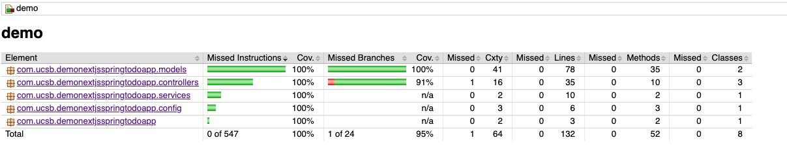
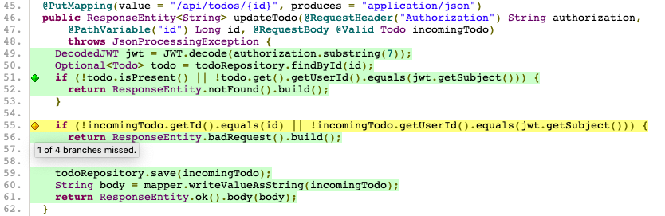

# Adding Edit to Todos

We start with creating the issue on the GitHub and adding the card for it to the GitHub project board.

- Make sure to take ownership of the card/issue!

# The backend

## Scoping out the backend

In order to support editing a Todo in our application, we first need to make sure the backend can support it. In order to determine how our backend is currently working, let's examine the current `updateTodo` method on the [TodoController](../src/main/java/com/ucsb/demonextjsspringtodoapp/controllers/TodoController.java).

```java
// TodoController.java#updateTodo
1 @PostMapping(value = "/api/todos/{id}", produces = "application/json")
2 public ResponseEntity<String> updateTodo(@RequestHeader("Authorization") String authorization,
      @PathVariable("id") Long id) {
3   DecodedJWT jwt = JWT.decode(authorization.substring(7));
4   Optional<Todo> todo = todoRepository.findById(id);
5   if (!todo.isPresent() || !todo.get().getUserId().equals(jwt.getSubject())) {
6     return ResponseEntity.notFound().build();
7   }
8   todo.get().setDone(!todo.get().getDone());
9   todoRepository.save(todo.get());
10  return ResponseEntity.noContent().build();
11}
```

Let's break down this API endpoint line by line:

- (1): This endpoint is currently mapped to `POST` requests at the `/api/todos/{id}` endpoint, where `{id}` is the id of the Todo. It should also produce a body with the type of `application/json`.
- (2): This endpoint is being resolved the this method. It expects the header of the request to have an `Authorization` field, and for the url to contain the path variable `id`.
  - Note: the `Authorization` header takes the form of `Bearer thisismytoken`
- (3): We decode the token without the `Bearer ` prefix into a JSON Web Token (JWT, pronounced "jot").
- (4): We attempt to retrieve the Todo with the `id` value in the path variable.
  - Note that the the type of the left-hand side is `Optional<Todo>`; this means the Todo may or may not be null.
- (5-7): If the Todo is either null or the Todo is not owned by the user making the request, then we reject the request with a `404 NOT FOUND` error.
  - If you're curious how we assign ownership to each Todo, you can look at the `saveTodo` method; you'll notice the `userId` is set to the JWT's subject field.
- (8): Now assuming the Todo exists and it is owned by the user making the request, we update the `done` field of the Todo.
- (9): We save the updated Todo
- (10): We return a `204 NO CONTENT` response to indicate that the update was successful.

Now that we understand the endpoint we're working with, we can notice a few behaviors that we might want to change.

- It would be helpful if the endpoint instead took in a Todo and used that Todo to update the values in the database. Otherwise, we would need to write an update endpoint per field of the Todo.
- If we're accepting general updates to the Todo, we should return a copy of the saved Todo in the response.
- If we're accepting an entire Todo to _update_ the object located at the url endpoint, it should be a `PUT` request instead of a `POST` request.

Now that we understand what changes we want to make, we can-

## Update the tests

Wait, what?

Well, if we're following Test Driven Development (TDD), tests are indeed the first place we should start. Jumping into [`TodoControllerTests`](../src/test/java/com/ucsb/demonextjsspringtodoapp/controllers/TodoControllerTests.java), we notice that there are 4 tests with the prefix `testUpdateTodo_`. We're going to replace those tests with the following tests:

```java
// TodoControllerTests.java
  @Test
  public void testUpdateTodo_todoExists_updateValues() throws Exception {
    Todo inputTodo = new Todo(1L, "new todo 1", false, "123456");
    Todo savedTodo = new Todo(1L, "old todo 1", true, "123456");
    String body = objectMapper.writeValueAsString(inputTodo);

    when(mockTodoRepository.findById(any(Long.class))).thenReturn(Optional.of(savedTodo));
    when(mockTodoRepository.save(inputTodo)).thenReturn(inputTodo);
    MvcResult response =
        mockMvc
            .perform(put("/api/todos/1").with(csrf()).contentType(MediaType.APPLICATION_JSON)
                .characterEncoding("utf-8")
                .header(HttpHeaders.AUTHORIZATION, "Bearer " + userToken()).content(body))
            .andExpect(status().isOk()).andReturn();

    verify(mockTodoRepository, times(1)).findById(inputTodo.getId());
    verify(mockTodoRepository, times(1)).save(inputTodo);

    String responseString = response.getResponse().getContentAsString();

    assertEquals(body, responseString);
  }

  @Test
  public void testUpdateTodo_todoNotFound() throws Exception {
    Todo inputTodo = new Todo(1L, "new todo 1", false, "123456");
    String body = objectMapper.writeValueAsString(inputTodo);

    when(mockTodoRepository.findById(1L)).thenReturn(Optional.empty());
    mockMvc.perform(put("/api/todos/1").with(csrf()).contentType(MediaType.APPLICATION_JSON)
        .characterEncoding("utf-8").header(HttpHeaders.AUTHORIZATION, "Bearer " + userToken())
        .content(body)).andExpect(status().isNotFound()).andReturn();
    verify(mockTodoRepository, times(1)).findById(1L);
    verify(mockTodoRepository, times(0)).save(any(Todo.class));
  }

  @Test
  public void testUpdateTodo_todoAtPathNotOwned() throws Exception {
    Todo inputTodo = new Todo(1L, "new todo 1", false, "123456");
    Todo savedTodo = new Todo(2L, "new todo 1", false, "NOT YOURS");
    String body = objectMapper.writeValueAsString(inputTodo);
    when(mockTodoRepository.findById(any(Long.class))).thenReturn(Optional.of(savedTodo));
    mockMvc.perform(put("/api/todos/1").with(csrf()).contentType(MediaType.APPLICATION_JSON)
        .characterEncoding("utf-8").header(HttpHeaders.AUTHORIZATION, "Bearer " + userToken())
        .content(body)).andExpect(status().isNotFound()).andReturn();
    verify(mockTodoRepository, times(1)).findById(1L);
    verify(mockTodoRepository, times(0)).save(any(Todo.class));
  }

  @Test
  public void testUpdateTodo_todoAtPathOwned_butTryingToOverwriteAnotherTodo() throws Exception {
    Todo inputTodo = new Todo(1L, "new todo 1 trying to overwrite at id 1", false, "123456");
    Todo savedTodo = new Todo(2L, "new todo 1", false, "123456");
    String body = objectMapper.writeValueAsString(inputTodo);
    when(mockTodoRepository.findById(any(Long.class))).thenReturn(Optional.of(savedTodo));
    mockMvc.perform(put("/api/todos/2").with(csrf()).contentType(MediaType.APPLICATION_JSON)
        .characterEncoding("utf-8").header(HttpHeaders.AUTHORIZATION, "Bearer " + userToken())
        .content(body)).andExpect(status().isBadRequest()).andReturn();
    verify(mockTodoRepository, times(1)).findById(2L);
    verify(mockTodoRepository, times(0)).save(any(Todo.class));
  }
```

While the names of the tests are somewhat self-explanatory, I'll explain their goals here:

- `testUpdateTodo_todoExists_updateValues`: This is a "happy path" test where we give a good request and expect a good response.
- `testUpdateTodo_todoNotFound`: This is the first error case, where we're making a request to update a Todo that doesn't exist. We expect a 404 response.
- `testUpdateTodo_todoAtPathNotOwned`: This is similar to the previous case, but this time the todo at the path is not owned by the user making the request. We still want to return a 404 response, as a user should not be aware of the existence of any Todo that isn't owned by them.
- `testUpdateTodo_todoAtPathOwned_butTryingToOverwriteAnotherTodo`: This is a more malicious error case, where the user owns the Todo at the path they're requesting (i.e. `/api/todos/2`) but the payload contains a Todo with an `id` that is not theirs. We would like for this to result in a `400 Bad Request` response.

All of these tests also handle the following:

- Changing the request type to `PUT`.
- Adding an entire Todo to the body of the request.

We'll now run the tests with `mvn test`, and scroll up to see that the 4 new tests are failing:

```
[ERROR] Failures:
[ERROR]   TodoControllerTests.testUpdateTodo_todoAtPathNotOwned:146 Status expected:<404> but was:<405>
[ERROR]   TodoControllerTests.testUpdateTodo_todoAtPathOwned_butTryingToOverwriteAnotherTodo:133 Status expected:<400> but was:<405>
[ERROR]   TodoControllerTests.testUpdateTodo_todoExists_updateValues:102 Status expected:<200> but was:<405>
[ERROR]   TodoControllerTests.testUpdateTodo_todoNotFound:120 Status expected:<404> but was:<405>
```

That's fine, even good; it means that our tests are detecting a difference between the current behavior of our endpoint and the new behavior described by these tests.

With that, it is finally time to start

## Updating the controller

The first thing we're going to do is make the endpoint map to incoming `PUT` requests by changing `@PostMapping` to `@PutMapping` as shown below:

```java
// TodoController.java#updateTodo
  // OLD
  @PostMapping(value = "/api/todos/{id}", produces = "application/json")
  // NEW
  @PutMapping(value = "/api/todos/{id}", produces = "application/json")
```

Also note that you'll need a new import at the top for the `PutMapping` annotation:

```java
import org.springframework.web.bind.annotation.PutMapping;
```

Running `mvn test` shows us that 2 of the 4 broken tests are now passing! The two that should be failing are shown below:

```
[ERROR] Failures:
[ERROR]   TodoControllerTests.testUpdateTodo_todoAtPathOwned_butTryingToOverwriteAnotherTodo:134 Status expected:<400> but was:<204>
[ERROR]   TodoControllerTests.testUpdateTodo_todoExists_updateValues:102 Status expected:<200> but was:<204>
```

Looking at the current behavior of `updateTodo`, it's clear that we still have behavior we need to update. The primary missing behavior is updating the entire Todo with the value of the incoming Todo.

We'll add this behavior with three changes:

- Update the method signature of `updateTodo` to accept the incoming Todo from the body of the request.
- Save the incoming Todo with the repository.
- Return the updated Todo in the body of the response. We'll also need to acknowledge that it _could_ throw a `JsonProcessingException`, but we'll set aside that error handling for another day.

The first change should look something like this:

```java
// TodoController.java#updateTodo
  // OLD
    public ResponseEntity<String> updateTodo(@RequestHeader("Authorization") String authorization,
      @PathVariable("id") Long id)
  // NEW
  public ResponseEntity<String> updateTodo(@RequestHeader("Authorization") String authorization,
      @PathVariable("id") Long id, @RequestBody @Valid Todo incomingTodo)
      throws JsonProcessingException
```

The second change should look something like this:

```java
// TodoController.java#updateTodo
  // OLD
  ...
  todo.get().setDone(!todo.get().getDone());
  todoRepository.save(todo);
  ...
  // NEW
  ...
  todoRepository.save(incomingTodo);
  ...
```

The third change should look something like this:

```java
// TodoController.java#updateTodo
  //OLD
  ...
  return ResponseEntity.noContent().build();
  // NEW
  String body = mapper.writeValueAsString(incomingTodo);
  return ResponseEntity.ok().body(body);
```

With those changes and a `mvn test`, we should be down to one failing test case:

```
[ERROR] Failures:
[ERROR]   TodoControllerTests.testUpdateTodo_todoAtPathOwned_butTryingToOverwriteAnotherTodo:133 Status expected:<400> but was:<200>
```

If you look closely at the code we have so far in `updateTodo`, you might notice why this test is failing. The problem is that we don't verify whether the Todo in the body actually shares the same `id` as the path of the url. We don't even check if the `userId` field of this Todo matches that of the user making the request!

In order to resolve this, we should add a pair of checks to verify that the `id` and `userId` of the `incomingTodo` matches that of the Todo in the body of the request. A possible solution is listed below:

- Note: if you're coming up with your own solution, don't forget to use `.equals` to compare things!

```java
// TodoController.java#updateTodo
  if (!todo.isPresent() || !todo.get().getUserId().equals(jwt.getSubject())) {
    return ResponseEntity.notFound().build();
  }
  // NEW CODE START
  if (!incomingTodo.getId().equals(id) || !incomingTodo.getUserId().equals(jwt.getSubject())) {
    return ResponseEntity.badRequest().build();
  }
  // NEW CODE END
  todoRepository.save(incomingTodo);
```

If we go ahead and run `mvn test`, we should see that all tests now pass. With that, we're all done-

## Check the coverage report

Oh, right. That thing.

You can get a coverage report by running `mvn test jacoco:report` and open it in your browser by running `open target/site/jacoco/index.html`. You should see something like this:



So it turns out we missed something. If we follow the missing coverage via `com.ucsb.demonextjsspringtodoapp.controllers > TodoController > updateTodo(String, Long, Todo)`, we'll be greeted by a coverage report of the `TodoController` file. If we hover over the yellow line in `updateTodo(String, Long, Todo)`, we should see the following:



It turns out that in our hurry to secure this endpoint against malicious requests, we forgot to add a test that fails when the `incomingTodo` has the correct `id` but incorrect `userId`.

Head back to the `TodoControllerTests.java` file and add a final test to cover the missing branch. An example test is shown below.

```java
// TodoController.java#updateTodo
  @Test
  public void testUpdateTodo_todoAtPathOwned_butTryingToInjectTodoForAnotherUser()
      throws Exception {
    Todo inputTodo = new Todo(1L, "new todo 1 trying to inject to user id 654321", false, "654321");
    Todo savedTodo = new Todo(2L, "new todo 1", false, "123456");
    String body = objectMapper.writeValueAsString(inputTodo);
    when(mockTodoRepository.findById(any(Long.class))).thenReturn(Optional.of(savedTodo));
    mockMvc.perform(put("/api/todos/1").with(csrf()).contentType(MediaType.APPLICATION_JSON)
        .characterEncoding("utf-8").header(HttpHeaders.AUTHORIZATION, "Bearer " + userToken())
        .content(body)).andExpect(status().isBadRequest()).andReturn();
    verify(mockTodoRepository, times(1)).findById(1L);
    verify(mockTodoRepository, times(0)).save(any(Todo.class));
  }
```

Run `mvn test jacoco:report` to regenerate the coverage report and refresh the page (or open again with `open target/site/jacoco/index.html`) to see that the coverage report is now reporting 100% coverage.

And with that, we've finished updating the backend!

If you haven't already, commit your changes.

# The frontend

## Scoping out the frontend

So now that backend is updated, let's check in on the frontend. In order to do this, we're going to run `mvn spring-boot:run`, and then visit `localhost:8080` in our browser.

Clicking around, it seems that most of the app still works _except_ for toggling a todo's `done` status.


Given that we're going to dive into frontend code, let's boot up the frontend _separately_ from the backend.

- Open either a new terminal window or tab and navigate to the root of this project.
- Run `cd frontend` to move into the `frontend` directory
- Run `npm install` and then `npm start`.

Now, if you visit `localhost:3000` in your browser, you'll see your frontend!

- Why bother doing this? You might have noticed that running `mvn spring-boot:run` is a tad slow. By running the frontend separately from our backend, we can see changes made to our React frontend almost instantly. We're still able to talk to our backend on `localhost:8080` as if it was on `localhost:3000` because of the `proxy` field defined in the `frontend/package.json`.

So it looks like our steps to completion are as follows:

- Fix the broken toggle behavior for (un)completing Todos.
- Add an editable form to each listed Todo.

Let's begin with the first one

## Fix the broken toggle behavior

If you take some time to look around, you might finally end up in `frontend/src/pages/Todos/Todos.js`. In particular, you might be looking at this function declaration here:

```javascript
// frontend/src/pages/Todos/Todo.js
const toggleTodo = async (index, id) => {
  await fetchWithToken(`/api/todos/${id}`, getToken, {
    method: "POST",
    headers: {
      "content-type": "application/json",
    },
    noJSON: true,
  });
  await mutateTodos();
};
```

There are two issues with the way this function works:

- The function only takes an `index` and an `id`, with not Todo item to put in the body of the request.
- The function has `method: "POST"` instead of `method: "PUT"`.

But let's follow TDD and first change the tests. The tests we end up wanting to fix are:

| File                                              | Test name                                                                         | Fix description                                         |
| ------------------------------------------------- | --------------------------------------------------------------------------------- | ------------------------------------------------------- |
| `frontend/src/pages/Todos/CheckboxButton.test.js` | `"clicking the button invokes the provided toggle method with correct arguments"` | We need to change what values `toggle` is invoked with. |
| `frontend/src/pages/Todos/Todos.test.js`          | `"can toggle existing todo"`                                                      | We need to add specificity to this test.                |

The changes should end up looking something like this for each test:

```javascript
// frontend/src/pages/Todos/CheckboxButton.test.js
test("clicking the button invokes the provided toggle method with correct arguments", () => {
  const toggleSpy = jest.fn();
  // Add the updated item here
  const updatedItem = {
    ...item,
    done: !item.done,
  };
  const { getByAltText } = render(
    <CheckboxButton item={item} index={0} toggle={toggleSpy} />
  );
  userEvent.click(getByAltText("checkbox"));
  expect(toggleSpy).toHaveBeenCalledTimes(1);
  // Expect the toggle method to be called with the updated item.
  expect(toggleSpy).toHaveBeenCalledWith(updatedItem, item.id);
});
```

```javascript
// frontend/src/pages/Todos/Todos.test.js
test("can toggle existing todo", async () => {
  const { getAllByAltText } = render(<TodoList />);
  const todoCheckboxes = getAllByAltText("checkbox");
  userEvent.click(todoCheckboxes[0]);
  await waitFor(() => expect(fetchWithToken).toHaveBeenCalledTimes(1));
  // Pick out and update the selected todo
  const selectedTodo = todos[0];
  const updatedTodo = {
    ...selectedTodo,
    done: !selectedTodo.done,
  };
  // Verify that fetchWithToken is called correctly
  expect(fetchWithToken).toHaveBeenCalledWith(
    "/api/todos/1",
    getAccessTokenSilentlySpy,
    {
      method: "PUT",
      headers: {
        "content-type": "application/json",
      },
      body: JSON.stringify(updatedTodo),
    }
  );
  expect(mutateSpy).toHaveBeenCalledTimes(1);
});
```

We can now open up another terminal window at the root of our project, `cd frontend`, and run `npm test` in order to see the test output. We should see 2 failing tests, and the output should clearly indicate the differences between the expectations and the actual output.

We can add both of the following code changes to resolve these testing issues.

```javascript
// frontend/src/pages/Todos/CheckboxButton.js
const handleCheckBoxClick = (e) => {
  e.preventDefault();
  // Clone and update the item
  const updatedItem = {
    ...item,
    done: !item.done,
  };
  // Pass the updatedItem to toggle.
  toggle(updatedItem, item.id);
};
```

- _Note_: The reason we make a clone of `item` and update the clone instead is to prevent any potential race conditions between the item's update cycle and calling the toggle method. If you want to learn more, you can read up on this [here](https://reactjs.org/docs/react-component.html#state).

```javascript
// frontend/src/pages/Todos/Todo.js
const toggleTodo = async (item, id) => {
  await fetchWithToken(`/api/todos/${id}`, getToken, {
    // Change the HTTP method to PUT
    method: "PUT",
    headers: {
      "content-type": "application/json",
    },
    // Add the todo item to the body of the request
    body: JSON.stringify(item),
    // Remove the noJSON field because we now receive an JSON in the response
  });
  await mutateTodos();
};
```

The tests should automatically run as you update the files, and should now all pass. Hit `q` in the test window to escape the testing loop, and then run `npm run coverage` to check the coverage report. It should report 100% coverage.

If you check over on your browser at `localhost:3000`, you should now see that toggling the todo's `done` field is now working.

Whew! 1 of 2 changes done; make sure to commit your changes and stretch out.

## Add an editable form to each todo item

Ideally, we'd be able to have some sort of edit button that we can click to allow us to edit the name of the todo item, and for that same button to save the changes when we're done.

Let's once more begin with the tests. We're going to write a test in `frontend/src/pages/Todos/Todos.test.js` that will exercise the form we're imagining.

```javascript
test("can edit a todo", async () => {
  // render the todo list
  const { getAllByText, getByDisplayValue, getByText } = render(<TodoList />);
  // find the edit button and click it
  const editButtons = getAllByText("Edit");
  userEvent.click(editButtons[0]);
  // declare the todo I'm selecting and it's updated version
  const selectedTodo = todos[0];
  const updatedTodo = {
    ...selectedTodo,
    value: "my new todo",
  };
  // find the input field for the todo that I'm editing
  const input = getByDisplayValue(selectedTodo.value);
  // clear and update the value of the input field
  userEvent.clear(input);
  userEvent.type(input, updatedTodo.value);
  // hit the "Done" button to save my changes
  const doneButton = getByText("Done");
  userEvent.click(doneButton);
  // wait for the request to come back
  await waitFor(() => expect(fetchWithToken).toHaveBeenCalledTimes(1));
  // double check that everything was called correctly
  expect(mutateSpy).toHaveBeenCalledTimes(1);
  expect(fetchWithToken).toHaveBeenCalledWith(
    "/api/todos/1",
    getAccessTokenSilentlySpy,
    {
      method: "PUT",
      headers: {
        "content-type": "application/json",
      },
      body: JSON.stringify(updatedTodo),
    }
  );
  // confirm that the done button reverts to being an edit button
  const editButtonsAfterEdit = getAllByText("Edit");
  expect(editButtonsAfterEdit.length).toBe(todos.length);
});
```

We can now begin writing code that will allow this test to pass.

In terms of keeping the `TodoItem` component from growing extremely bloated, we're going to create a new `TodoEditForm` component that will handle displaying the form along with the button. It will also make testing the behavior of the form itself cleaner, as it does not have to live alongside the tests for `TodoItem` as well.

We can begin by changing the return value in `frontend/src/pages/Todos/TodoItem` to:

```javascript
<ListGroup.Item style={{ backgroundColor }}>
  <Row>
    <Col md={1}>
      <CheckboxButton item={item} toggle={toggleTodo} />
    </Col>
    <Col md={10}>
      <TodoEditForm />
    </Col>
    <Col md={1}>
      <Button className="btn-danger" onClick={(e) => deleteTodo(item.id)}>
        Delete
      </Button>
    </Col>
  </Row>
</ListGroup.Item>
```

Making this change will break a large number of tests due to `TodoEditForm` being undefined To achieve this, we'll create the files `TodoEditForm.js` and `TodoEditForm.test.js` in the `frontend/src/pages/Todos/` directory, and filling them like so:

```javascript
// frontend/src/pages/Todos/TodoEditForm.js
import React from "react";

const TodoEditForm = () => {
  return <div>Todo Edit Form</div>;
};

export default TodoEditForm;
```

```javascript
// frontend/src/pages/Todos/TodoEditForm.test.js
import React from "react";
import { render } from "@testing-library/react";
import TodoEditForm from "./TodoEditForm";

describe("Todo Edit Form tests", () => {
  test("renders without crashing", () => {
    render(<TodoEditForm />);
  });
});
```

You'll also need to add the following import to `frontend/src/pages/Todos/TodoItem.js`:

```javascript
// frontend/src/pages/Todos/TodoItem.js
import TodoEditForm from "./TodoEditForm";
```

If you look at the tests now, you should see that tests for `TodoItem` are also failing; we should quickly update them to fit our new expectations.

We need to update the `"renders complete item correctly"` test to be the following:

```javascript
// frontend/src/pages/Todos/TodoItem.test.js
test("renders complete item correctly", () => {
  const props = {
    item: {
      value: "value",
      id: 1,
      done: true,
    },
    index: 0,
    toggleTodo: jest.fn(),
    deleteTodo: jest.fn(),
  };
  // Change this to be getByDisplayValue because the item name will now be in a form input
  const { getByDisplayValue } = render(<TodoItem {...props} />);
  // Update the call being made below as well
  const item = getByDisplayValue(props.item.value);
  expect(item).toBeInTheDocument();
});
```

We now need to consider what goes into creating an edit form for Todos. We have the following requirements as per the test we wrote for `frontend/src/pages/Todos/.test.js`:

- There must be a button with `Edit` on each Todo item.
- The form should have the current value of the Todo item in an input field.
- When the `Edit` button is clicked, user should then be able to select and update the input field containing the Todo's value.
- When `Edit` button is clicked, a `Done` button should appear (perhaps replacing `Edit`?) on each Todo being edited.
- When `Done` is clicked, the component should revert to having an `Edit` button, and the update request should be fired.

Let's go ahead and encode some of these requirements into tests in `frontend/src/pages/Todos/TodoEditForm.test.js`:

```javascript
import React from "react";
import { render } from "@testing-library/react";
import userEvent from "@testing-library/user-event";
import TodoEditForm from "./TodoEditForm";

describe("Todo Edit Form tests", () => {
  const item = {
    value: "todo",
    id: 1,
    userId: "123456",
    done: false,
  };
  const update = jest.fn();

  const props = {
    item,
    update,
  };

  test("renders without crashing", () => {
    render(<TodoEditForm {...props} />);
  });

  test("there should be an edit button on the form", () => {
    const { getByText } = render(<TodoEditForm {...props} />);
    const editButton = getByText("Edit");
    expect(editButton).toBeInTheDocument();
  });

  test("clicking on the edit button should change the button to show done instead", () => {
    const { getByText } = render(<TodoEditForm {...props} />);
    const editButton = getByText("Edit");
    userEvent.click(editButton);
  });

  test("going into edit mode, updating the value, and clicking done behaves correctly", () => {
    const { getByText, getByDisplayValue } = render(
      <TodoEditForm {...props} />
    );
    const updatedItem = {
      ...item,
      value: "updated todo",
    };

    const editButton = getByText("Edit");
    userEvent.click(editButton);
    const input = getByDisplayValue(item.value);
    userEvent.clear(input);
    userEvent.type(input, updatedItem.value);

    const doneButton = getByText("Done");
    userEvent.click(doneButton);

    const editButtonAfterDone = getByText("Edit");
    expect(editButtonAfterDone).toBeInTheDocument();

    expect(update).toHaveBeenCalledTimes(1);
    expect(update).toHaveBeenCalledWith(updatedItem, updatedItem.id);
  });
});
```

To make all of these tests pass, we're going to need to make the following changes:

```javascript
// frontend/src/pages/Todos/TodoItem.js
return (
  ...
  <Col md={10}>
    <TodoEditForm update={toggleTodo} item={item} />
  </Col>
  ...
)
```

- _Note_: we'll come back and refactor the very outdate `toggleTodo` name afterwards.

```javascript
// frontend/src/pages/Todos/TodoEditForm.js
import React, { useState } from "react";
import { Button, Form } from "react-bootstrap";

const TodoEditForm = ({ item, update }) => {
  const [editMode, setEditMode] = useState(false);
  const [value, setValue] = useState(item.value);

  const buttonName = editMode ? "Done" : "Edit";
  const textDecoration = !editMode && item.done ? "line-through" : "none";

  const handleOnClickOrSubmit = (event) => {
    event.preventDefault();
    if (editMode) {
      const updatedItem = {
        ...item,
        value,
      };
      update(updatedItem, updatedItem.id);
    }
    setEditMode(!editMode);
  };

  return (
    <Form inline onSubmit={handleOnClickOrSubmit}>
      <Form.Control
        style={{ width: "90%", textDecoration }}
        type="text"
        placeholder="todo name"
        readOnly={!editMode}
        plaintext={!editMode}
        value={value}
        onChange={(e) => setValue(e.target.value)}
      />
      <Button onClick={handleOnClickOrSubmit}>{buttonName}</Button>
    </Form>
  );
};

export default TodoEditForm;
```

Go ahead and run the tests and coverage report with `npm run coverage`; it should report 100% coverage. If you check out `localhost:3000`, you should see something akin to the following:


## Clean up

There are two things we should clean up before making a PR:

- `toggleTodo` is incorrectly named; it should be something like `updateTodo`
- We don't prevent the user from saving a blank todo.

Going in order, let's first refactor `toggleTodo` to be `updateTodo`. Let's break with TDD for a moment and simply do our rename for `toggleTodo` in `TodoItem.js`:

```javascript
// frontend/src/pages/Todos/TodoItem.js
export function TodoItem({ item, index, updateTodo, deleteTodo }) {
  ...
  return (
    ...
        <Col md={1}>
          <CheckboxButton item={item} toggle={updateTodo} />
        </Col>
        <Col md={10}>
          <TodoEditForm update={updateTodo} item={item} />
        </Col>
    ...
  );
}
```

If you run tests, you'll notice that quite a number of tests are broken. This is one of the benefits of having high code coverage; any consequential change you make should be detected by tests. One of the key benefits of TDD is high code coverage, which is why we encourage it.

Go ahead and make the following changes to `Todo.js` and `TodoItem.test.js` in order to resolve the tests:

```javascript
// frontend/src/pages/Todos/Todo.js
const TodoList = () => {
  ...
  // const toggleTodo = ...
  const updateTodo = async (item, id) => {
    ...
  };
  ...
  var items = todoList.map((item, index) => {
    return (
      <TodoItem
        key={index}
        item={item}
        index={index}
        // toggleTodo={toggleTodo}
        updateTodo={updateTodo}
        deleteTodo={deleteTodo}
      />
    );
  });
  ...
};

export default TodoList;

```

```javascript
// frontend/src/pages/Todos/TodoItem.test.js
import React from "react";
import { screen, render } from "@testing-library/react";
import { TodoItem } from "./TodoItem";
import userEvent from "@testing-library/user-event";

describe("TodoItem tests", () => {
  test("renders without crashing", () => {
    const props = {
      ...
      //toggleTodo: jest.fn(),
      updateTodo: jest.fn(),
      ...
    };
    ...
  });

  test("renders complete item correctly", () => {
    const props = {
      ...
      //toggleTodo: jest.fn(),
      updateTodo: jest.fn(),
      ...
    };
    ...
  });

  test("clicking on checkbox button triggers toggleTodo -> updateTodo", () => {
    const props = {
      ...
      //toggleTodo: jest.fn(),
      updateTodo: jest.fn(),
      ...
    };
    ...
    expect(props.updateTodo).toHaveBeenCalledTimes(1);
  });

  test("clicking on delete button triggers toggleTodo -> deleteTodo", () => {
    const props = {
      ...
      //toggleTodo: jest.fn(),
      updateTodo: jest.fn(),
      ...
    };
    ...
  });
});
```

To add some validation to `TodoEditForm.js`, we'll first write a test to demonstrate the bug:

```javascript
// frontend/src/pages/Todos/TodoEditForm.test.js
test("should not be able to update the todo with an empty string for the value", () => {
  const { getByText, getByDisplayValue } = render(<TodoEditForm {...props} />);
  const updatedItem = {
    ...item,
    value: "updated todo",
  };

  const editButton = getByText("Edit");
  userEvent.click(editButton);
  const input = getByDisplayValue(item.value);
  userEvent.clear(input);

  const doneButton = getByText("Done");
  userEvent.click(doneButton);

  expect(getByText("Done")).toBeInTheDocument();
  expect(update).toHaveBeenCalledTimes(0);
});
```

And then we'll update component to disallow that behavior:

```javascript
// frontend/src/pages/Todos/TodoEditForm.js
const TodoEditForm = ({ item, update }) => {
  ...

  const handleOnClickOrSubmit = (event) => {
    event.preventDefault();
    if (value.length === 0) {
      return;
    }
    ...
  };
  ...
};
```

If we think about it a little bit more, we also probably don't want strings filled with whitespace to be saved either; again, we'll write the test:

```javascript
// frontend/src/pages/Todos/TodoEditForm.test.js
test("should not be able to update the todo with an whitespace for the value", () => {
  const { getByText, getByDisplayValue } = render(<TodoEditForm {...props} />);
  const updatedItem = {
    ...item,
    value: "updated todo",
  };

  const editButton = getByText("Edit");
  userEvent.click(editButton);
  const input = getByDisplayValue(item.value);
  userEvent.clear(input);
  userEvent.type(input, "     ");

  const doneButton = getByText("Done");
  userEvent.click(doneButton);

  expect(getByText("Done")).toBeInTheDocument();
  expect(update).toHaveBeenCalledTimes(0);
});
```

And then we'll update the component:

```javascript
// frontend/src/pages/Todos/TodoEditForm.js
const TodoEditForm = ({ item, update }) => {
  ...

  const handleOnClickOrSubmit = (event) => {
    event.preventDefault();
    if (value.trim().length === 0) {
      return;
    }
    ...
  };
  ...
};
```

And just like that, we've protected our user from empty/whitespace Todos!

Check that coverage is still solid with `npm run coverage`, and check that it's 100%. If it is, commit and push because we're done coding for now.

Also, don't forget to move your card over to `In QA`, `In Review`, or `Done` depending on your team's workflow.
